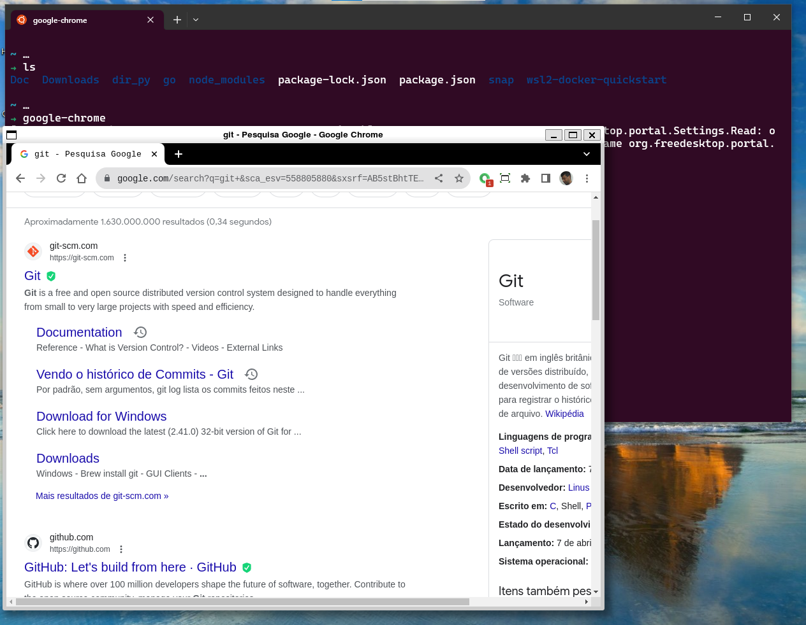

# Usando windows terminal na aba Ubuntu.

- Atualize a distro:
```
sudo apt update

sudo apt upgrade
```
- quer conferir a versão do Ubuntu
```
lsb_release -a
```

## Pode usar ides e outros programas graficos como google chrome, vscode...

[vscode download](https://code.visualstudio.com/download)

```
sudo apt-get install wget ca-certificates
```
- instale a extensão wsl no vscode.
[Clique aqui](https://marketplace.visualstudio.com/items?itemName=ms-vscode-remote.remote-wsl)

[Google-chrome](https://learn.microsoft.com/pt-br/windows/wsl/tutorials/gui-apps) e outro programas úteis para trabalhar no wslg.


